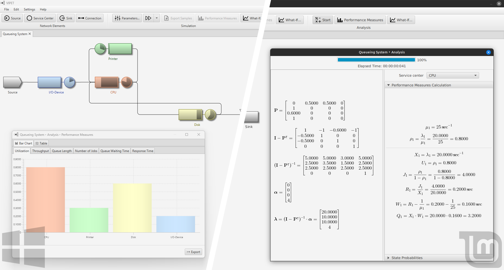

# VIPET 


VIPET (**V**isual and **I**nteractive **P**erformance **E**valuation **T**ool) is a cross-platform desktop application
featuring rich and intuitive graphical user interface for creating, simulating, and analyzing queuing networks.



## Features

- **Visual network editor** — draw sources, service centers, sinks and connections on a canvas; edit every
  property through dialogs. Open and closed networks are detected automatically.
- **Analytical solvers** — **Jackson** networks (open) and **Gordon–Newell** networks (closed), with state
  probabilities and the full derivation rendered as LaTeX formulas.
- **Discrete-event simulation** — automatic or *guided* (step-by-step) runs, multiple independent replications,
  confidence intervals, warm-up discarding and a choice of random generators.
- **What-if analysis** — sweep one variable (service or inter-arrival distribution, number of servers, number of
  jobs in the network) over a range and chart its effect on every performance measure.
- **Performance measures** — utilization, throughput, queue length, number of jobs, queue waiting time and
  response time, per service center and for the network as a whole, as table or bar chart.
- **Import / export** — networks as JSON; results as CSV, XLSX, XLS or JSON; raw simulation samples as XLSX;
  canvas screenshots as images.
- **Modeling primitives** — service/arrival distributions (exponential, Erlang, hyperexponential, uniform,
  deterministic, Pareto), queue disciplines (FIFO, LIFO, SIRO) and routing strategies (probabilistic,
  random, round-robin).
- **Localization** — English and Serbian, switchable at runtime from *Settings → Language*.

## Installation

Download the latest [release](https://github.com/danijelaskov/vipet/releases) for your platform:

| Platform | Artifact |
| --- | --- |
| Windows | `.msi` installer |
| Linux (Debian/Ubuntu) | `.deb` package |
| Linux (portable) | `.AppImage` |

Installers bundle their own Java runtime — no JDK is required to run VIPET.

## Running from source

Requires **JDK 21** (JavaFX is pulled in by Gradle). No local Gradle installation is needed.

| Command | What it does |
| --- | --- |
| `gradlew run` | Start the app in development mode |
| `gradlew run --args="--lang en --maximized"` | ...with command-line options |
| `gradlew test` | Run the test suite |
| `gradlew build` | Compile, test, assemble |

On Linux, macOS, Git Bash, and PowerShell, run `./gradlew`. On Windows Command Prompt, run `gradlew`.

Example networks ship with the application in `src/main/resources/dev/askov/vipet/networks/` — `open/` for
Jackson, `closed/` for Gordon–Newell. None of them are loaded at startup: open the JSON files with
*File → Open*, or preload them with `--networks`, which addresses them as classpath resources.

## Configuration

Two configuration sources are read at startup: the command line, and `src/main/resources/application.properties`.
**The properties file is applied last, so every key it defines overrides the corresponding command-line option.**
Comment a key out there to make the matching option take effect. Startup networks are the exception — the two
sources are concatenated rather than overridden, so `--networks` always works.

### Command-line options

| Option | Description | Default |
| --- | --- | --- |
| `--networks`, `-n` | Network(s) to load on startup, as classpath resource paths relative to `dev/askov/vipet/` (e.g. `networks/open/net_jackson_simple.json`) | – |
| `--lang`, `-l` | UI language: `en` or `sr` | system locale if supported, else `en` |
| `--style`, `-s` | JavaFX theme: `MODENA` or `CASPIAN` | `MODENA` |
| `--maximized`, `-m` | Start maximized | `false` |
| `--width`, `-w` | Window width | `800` |
| `--height`, `-h` | Window height | `600` |

### `application.properties`

Besides the window, language and startup networks, this file holds settings with no command-line equivalent:

| Key | Description |
| --- | --- |
| `math.decimalDigits`, `math.groupingUsed`, `math.roundingMode` | How numbers are formatted throughout the UI |
| `rng.type` | Default random generator: `Well512a`, `Well1024a`, `Well19937a`, `Well19937c`, `Well44497a`, `Well44497b` or `MersenneTwister` |
| `rng.seed` | Default simulation seed |

Out of the box VIPET starts maximized in Serbian with a single empty network: `networks=` is blank, so nothing
is preloaded. Set it to a comma-separated list of resource paths to open networks on every launch.

## Building installers

| Command | Output |
| --- | --- |
| `gradlew jlink` | Self-contained runtime image in `build/image` |
| `gradlew jpackage` | Native installer for the host OS (`.msi` / `.deb` / `.dmg`) |
| `gradlew prepareAppDir` | Linux only: AppDir in `build/AppDir`, input for `appimagetool` |

`jpackage` builds an installer for the platform it runs on, so each artifact is produced on its own runner.
Pushing a `v*` tag triggers [`release.yml`](.github/workflows/release.yml), which runs CI on Linux, macOS and
Windows, builds the `.msi`, `.deb` and `.AppImage`, and publishes a GitHub release using
`relnotes/<tag>.md` as the release body.

## Project layout

```
src/main/java/dev/askov/vipet/
├── core/              # solvers and simulation engine, free of UI code
│   ├── analyzer/      #   Jackson and Gordon–Newell analyzers
│   ├── simulator/     #   discrete-event simulator, sample generation and analysis
│   └── performancemeasures/
├── mvc/               # JavaFX layer: models, views, controllers
├── serialization/     # JSON / CSV / Excel importers and exporters
├── configuration/     # CLI arguments and application.properties
└── localization/      # resource-bundle management
src/main/resources/
├── dev/askov/vipet/   # FXML, CSS, images, example networks
└── i18n/              # messages.properties (en), messages_sr.properties (sr)
```

Build and packaging settings live in `gradle.properties` (`app.*`, `java.version`, `javafx.version`); dependency
versions live in `gradle/libs.versions.toml`.

## Development notes

- **Formatting** — the build uses [Spotless](https://github.com/diffplug/spotless) with `googleJavaFormat`.
  Run `gradlew spotlessApply` before committing; `gradlew build` fails on violations.
- **Logs** — development runs write to `./logs/`; installed builds write to `%LOCALAPPDATA%\VIPET\logs\`
  (Windows), `~/Library/Logs/VIPET/` (macOS) or `~/.vipet/logs/` (Linux).
- **Tests** — JUnit 5, covering the analyzers, the simulator and JSON network import. They touch JavaFX
  classes, so on headless Linux they need Xvfb, as CI does.

## Contributing

Contributions are very welcome — there is so much still to add here, and there is room for ideas of every size.
Bug reports, fixes, new features, documentation, translations and plain questions all help. Open an
[issue](https://github.com/danijelaskov/vipet/issues) or send a pull request; if you are unsure whether
something fits, open an issue first and let's talk it through. Don't be shy about picking up something big.

If VIPET is useful to you, please ⭐ [star the repository](https://github.com/danijelaskov/vipet) — it helps
other people find the project.

## License

Licensed under the [GNU General Public License v3.0](LICENSE).
Third-party license texts are in [`licenses/`](licenses).
